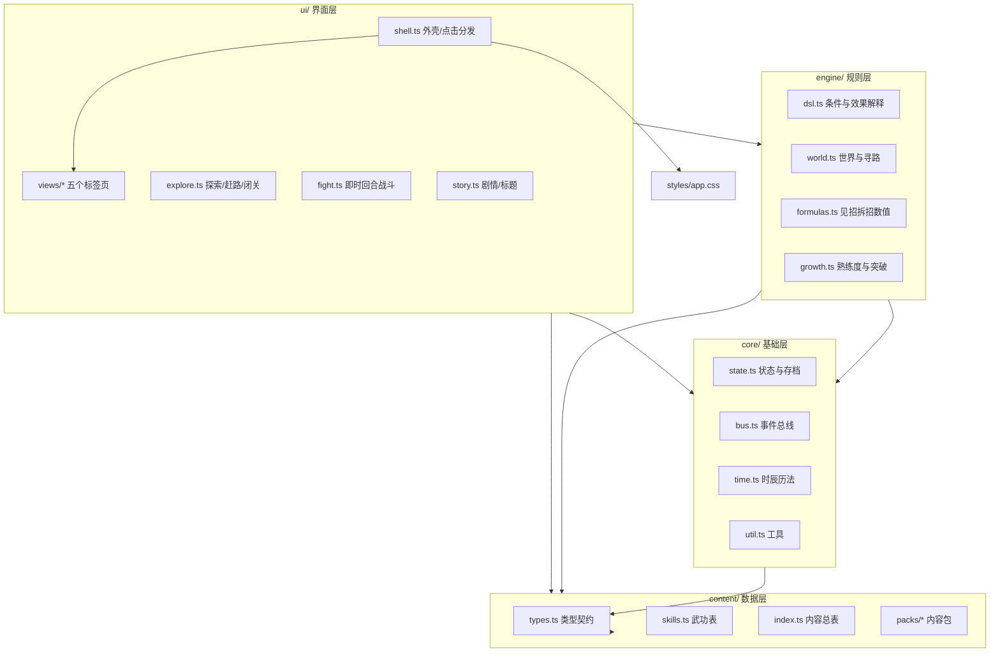
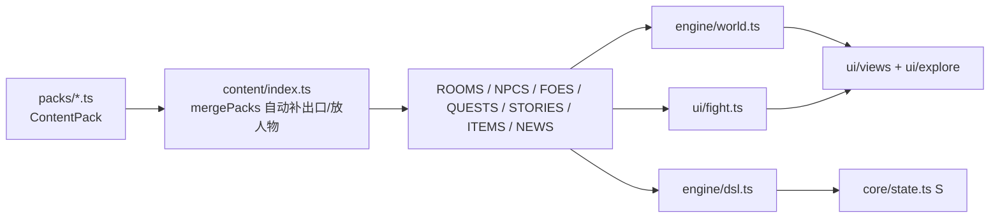

# 江湖夜雨 · Code Wiki

> 单机 · 手机竖屏 · 全程点按的中文文字武侠游戏。
> 面向开发者与 Coding AI 的项目结构、模块职责、关键函数与运行方式索引。
>
> 本文档描述的是**仓库里现有的可运行代码**（截至 `src/`、`tests/`、`.github/` 均已落地）。

---

## 0. 一句话与事实速查

| 维度 | 内容 |
| --- | --- |
| 项目名 | 江湖夜雨（暂名），npm 包名 `jianghu-yeyu`，版本 `0.1.0` |
| 类型 | 单机文字武侠；手机浏览器 H5，竖屏，点按操作，无需输入指令 |
| 技术栈 | Vite 8 + TypeScript 7 + Vitest 5；**不依赖任何 UI 框架**（原生 DOM + 模板字符串） |
| 环境要求 | Node.js 22 及以上 |
| 入口 | `index.html` → `src/main.ts` |
| 存档 | `localStorage`，键名 `jhyy-save-v2`，存档版本 `v: 2` |
| 部署 | `main` 分支推送后 GitHub Pages 自动部署（Actions） |
| 试玩 | https://mud4u404.github.io/game006/ |
| 已实现范围 | 标题画面；序章「瓜洲夜雨」；第一回「扬州」（五处地点、柳寒舟切磋、屠千山首领战、战后说书） |

---

## 1. 仓库结构

```text
game006/
├── index.html                  入口 HTML，加载 Google Fonts，挂载 #app
├── package.json                脚本与依赖（Vite / TypeScript / Vitest）
├── vite.config.ts              base: './'，产物 dist/，target es2020
├── tsconfig.json               严格模式，include: src / tests / vite.config.ts
├── README.md                   项目愿景、试玩地址、已定方向
├── AGENTS.md                   给 AI 协作者的分工、流程与硬性规定
├── CODE_WIKI.md                本文档
├── .trae/rules/project_rules.md  Trae 自动读取的规则摘要
├── .github/
│   ├── workflows/ci.yml        PR / push：npm run check + npm run build
│   ├── workflows/pages.yml     main 推送后构建并部署到 GitHub Pages
│   ├── ISSUE_TEMPLATE/         bug / feature / content 模板
│   └── pull_request_template.md
├── docs/
│   ├── design.md               总体设计：定位、世界观、地图、玩法系统、路线图
│   ├── story.md                开局与主线：主角、序章、章回、结局、人物
│   └── content-guide.md        内容编写指南：数据格式、文风、数值参考
├── prototype/
│   └── yangzhou-demo.html      早期单文件原型，仅作参考，不再修改
├── scripts/
│   └── smoke.mjs               端到端冒烟测试（Playwright，从标题玩到首领战）
├── src/
│   ├── main.ts                 应用入口
│   ├── styles/app.css          全部样式（D「素白卡片」风格）
│   ├── core/                   状态、存档、事件总线、时间、工具
│   ├── content/                内容数据与类型（协作者主要工作区）
│   ├── engine/                 规则：条件/效果解释、世界与寻路、武学公式、成长
│   └── ui/                     界面：外壳、标签页、战斗、剧情、标题
└── tests/
    ├── content.test.ts         内容校验（引用、通路、兜底、禁用名字、引号……）
    ├── engine.test.ts          引擎、时间、公式、条件效果测试
    └── forbidden-names.ts      禁用的作品原名清单
```

---

## 2. 架构分层与依赖方向

四层，依赖**单向向下**，用一条极简事件总线和 `hooks` 表避免循环引用。



关键约束：

1. `content/` 只依赖 `types.ts`，是**纯数据**，不含逻辑，可被测试独立加载。
2. `engine/` 依赖 `content/` 与 `core/`，**不含任何 DOM 代码**（所以公式、条件、效果都能单测）。
3. `ui/` 是唯一操作 DOM 的层，通过 `shell.ts` 的 `data-act` 统一分发点击。
4. 战斗和剧情这两个较大的模块，在模块加载时把入口挂到 `shell.ts` 的 `hooks`（`hooks.startFight` / `hooks.openStory`），从而让 `engine → ui` 的反向调用变成 `engine` 产出 `Outcome`、`ui` 消费 `Outcome`。

---

## 3. 模块职责与关键函数

### 3.1 `src/main.ts`（入口）

```ts
import './styles/app.css';
import { buildShell } from './ui/shell';
import './ui/explore';   // 副作用：注册探索类点击处理
import './ui/fight';     // 副作用：注册战斗处理并挂 hooks.startFight
import { showTitle } from './ui/story';

buildShell();
showTitle(true);         // true = 有存档时显示「继续」
```

### 3.2 `src/core/`（基础层）

| 文件 | 职责 | 关键导出 |
| --- | --- | --- |
| `state.ts` | 全局游戏状态、存档读写 | `GameState`、`ATTR0`、`S`、`setState`、`newGame`、`skipToYangzhou`、`save`、`load`、`clearSave`、`fullName`、`pushFeed` |
| `bus.ts` | 引擎 → 界面的极简事件总线（仅 `toast`） | `on`、`emit` |
| `time.ts` | 时辰、日期、赶路耗时 | `shichen`、`dayName`、`dateStr`、`advanceDays`、`advanceMin`、`minLabel`、`Clock` |
| `util.ts` | DOM/随机/中文数字/文本工具 | `$`、`rnd`、`pick`、`clamp`、`reduceMotion`、`buzz`、`cn`、`liang`、`M`/`MO`/`H`、`fmt`、`cleanName` |

**`GameState`（`state.ts`）字段一览**

| 字段 | 说明 |
| --- | --- |
| `v: 2` | 存档版本，`load()` 校验，不匹配即视为无效 |
| `chapter` | `0` 为序章，`1` 起为第几回 |
| `name` / `loc` | 名（姓固定为「沈」）/ 当前地点 id |
| `month` `day` `min` `weather` | 时间与天气；`min` 为一天内第几分钟 |
| `hp` `hpMax` `mp` `mpMax` | 气血与内力 |
| `silver` `items` | 银两、物品数量表 `Record<itemId, number>` |
| `quests` `track` | 任务进度表、当前追踪的任务 id |
| `flags` `rel` | 布尔标记表、人物关系表 |
| `title` `xia` `eming` | 名号、侠义、恶名（侠义与恶名**互不抵消**） |
| `attr` | 五维：体魄 / 根骨 / 身法 / 悟性 / 胆魄 |
| `skills` | `Partial<Record<SkillId, { r: 境界, p: 熟练度 }>>` |
| `feed` | 见闻（最多 20 条，最新的在最前） |
| `story` | 最近一次首领战的「战后说书」，供 `{story}` 占位符与说书人引用 |
| `sel` `reply` `tab` | 当前选中的人物/物品、当前回应文本、当前标签页 |

- `newGame()`：从序章「瓜洲夜雨」开始，属性略低（由「童年三忆」补足），初始已会寒江剑法 / 心法 / 踏雪无痕。
- `skipToYangzhou()`：跳过序章，直接以原型配置从扬州瘦西湖畔开始（标题画面的「跳过序章」用它）。
- `pushFeed(t, x)`：`unshift` 新见闻并把长度截到 20。

### 3.3 `src/content/`（数据层）

| 文件 | 职责 | 关键导出 |
| --- | --- | --- |
| `types.ts` | **全部内容数据的类型契约** | `Cond`、`Effect`、`Branch`、`RoomDef`、`NpcDef`、`FoeDef`、`SkillDef`、`QuestDef`、`StoryDef`、`ItemDef`、`NewsDef`、`RegionDef`、`ContentPack` 等 |
| `skills.ts` | 武功表与境界表（维护者维护） | `SKILLS`、`skillById`、`REALMS`、`REALM_NEED`、`GRADES` |
| `index.ts` | **内容总表**：自动收录内容包并做合并 | `mergePacks`、`Registry`、`REGIONS`/`ROOMS`/`NPCS`/`FOES`/`QUESTS`/`STORIES`/`ITEMS`/`NEWS`、`room`/`npc`/`foeById`/`questById`/`itemById`/`storyById` |
| `packs/*.ts` | 内容包（每个文件 `export default` 一个 `ContentPack`） | 见 §5 |

**`index.ts` 的自动收录与合并**（新增内容无需改这里）：

```ts
const modules = import.meta.glob<{ default: ContentPack }>('./packs/*.ts', { eager: true });
const packs = Object.keys(modules).sort().map(k => modules[k].default);
```

`mergePacks()` 做两件事：

1. **补回程出口**：地点出口写成 `[方位, 目标id, 回程方位]` 时，自动给目标地点补上回来的出口，避免去改别人的文件。
2. **按 `at` 放人物**：人物写了 `at: { room, if }` 时，自动放进该地点的 `npcs`（物品 `obj: true` 放进 `objs`）。

**核心数据契约（`types.ts` 摘要）**

- `Cond`（条件）——所列字段需**同时满足**；`any` 为「任一满足」：
  `flag` / `notFlag` / `quest{id,is?,atLeast?,below?}` / `chapter` / `silver` / `item{id,atLeast?}` / `noItem` / `rel{npc,is?,not?}` / `learned` / `notLearned` / `attr{key,atLeast}` / `xia` / `eming` / `hour{from,to}`（可跨午夜）/ `any[]`。
- `Effect`（效果）——按顺序执行，共 20 余种：
  `flag`、`quest`、`track`、`feed`、`feedReset`、`toast`、`silver`、`item`、`rel`、`prof`、`learn`、`attr`、`xia`、`eming`、`title`、`chapter`、`move`、`time{add?,set?}`、`weather`、`heal`、`news`、`fight`、`story`。
- `Branch`：`{ if?, text?, do? }`，从上往下取**第一个成立**的分支；内容校验要求**最后一个分支必须不带 `if`**（保证总有回应）。
- `RoomDef`：`desc` / `road` 可为字符串或分支列表；`onEnter` 为进入触发；`map: [x, y]` 为地图百分比坐标（5–95）。
- `NpcDef`：`obj: true` 表示是物品（用 `icon`）；`altName` 可在条件变化后改名；`verbs` 列动作，`actions` 写分支。
- `FoeDef`：`tells` 为对手「重招」（`pw: { li, su, qiao, xi }` 力/速/巧/隙）；`spar` 为切磋（三成血即止）；`script` 为剧本战（`win-at-zero` / `rescue`）；`results: { win, lose?, flee?, yield? }`。

### 3.4 `src/engine/`（规则层，无 DOM）

| 文件 | 职责 | 关键导出 |
| --- | --- | --- |
| `dsl.ts` | **条件与效果解释器**，内容数据的心脏 | `test`、`pickBranch`、`run`、`newOutcome`、`textVars`、`Outcome` |
| `world.ts` | 世界查询、寻路、对人做事、进入触发 | `roomNpcs`、`roomObjs`、`roomDesc`、`roadText`、`hopMin`、`pathTo`、`pathMin`、`curQuest`、`npcName`、`act`、`enter` |
| `formulas.ts` | 见招拆招「以己之长」的数值规则（纯函数） | `RESP`、`huohou`、`odds`、`chengN`、`cheng`、`tellPw`、`respOptions`、`judgeText` |
| `growth.ts` | 熟练度累积与境界突破、习得武功 | `gainProf`、`learnSkill` |

**`dsl.ts` 工作机制**

- `test(c?: Cond)`：逐字段判断条件。
- `run(effects, out)`：顺序执行效果；除 `fight` / `story` 两种需要界面配合的效果记进 `Outcome` 外，其余当场改写 `S`。
- `Outcome`：`{ fight?, story?, moved?, vars, breaks }`——`vars` 供文字占位符（如 `{news}`）引用，`breaks` 收集本次产生的突破提示。
- `textVars()`：全局占位符 `{given}`（名）/ `{name}`（全名）/ `{story}`（战后说书）。

**`world.ts` 关键点**

- `pathTo(from, to)`：按出口做 **BFS**，返回依次经过的地点（不含起点）；`pathMin` 累加相邻 `hopMin` 得到赶路分钟数；`hopMin(a, b) = max(t_a, t_b) || 10`。
- `act(id, verb)`：执行人物动作。`观察` 直接返回 `look`；命中 `actions[verb]` 的分支则 `run` 其效果；未写 `actions` 的 `赠礼`/`请教`/`切磋`/`偷窃` 走默认回应。
- `enter(id)`：进入地点时的 `onEnter` 触发。
- `curQuest()`：返回当前追踪任务的 `{ name, title, to }`，`to` 供「点横幅自动赶路」。

**`formulas.ts` 数值规则**（详见 `docs/design.md` 第四节）

```text
成算 = 起点 + (你的火候 − 对手这一招的对应强度) × 2.5%，限制在 5%–95%
起点：硬接/闪避/拆招 = 50%，抢攻 = 35%
火候 = 对应武功的境界 × 10 + 对应属性
       （硬接额外加当前内力的充足程度 0–10）
```

| 应对 `RespKey` | 动作 | 依据武功 | 对应强度项 |
| --- | --- | --- | --- |
| `block` | 硬接 | 寒江心法（内功） | `li` 力 |
| `dodge` | 闪避 | 踏雪无痕（轻功） | `su` 速 |
| `parry` | 拆招 | 寒江剑法 | `qiao` 巧 |
| `rush` | 抢攻 | 惊鸿剑 | `xi` 隙 |

- `respOptions(s, pw)`：**只列出玩家已学的武功**，标出成算、内力消耗与是否不可选。
- `tellPw(t, phase)`：首领二阶段时四项强度各 +5。
- `judgeText`：取重招最突出的一项，与玩家对应火候比较，生成「远在你之上 / 略胜于你 / 在伯仲之间 / 却未必胜得过你」的判断句。

### 3.5 `src/ui/`（界面层）

| 文件 | 职责 | 关键导出 |
| --- | --- | --- |
| `shell.ts` | 界面外壳与**统一点击分发** | `buildShell`、`registerHandlers`、`hooks`、`afterOutcome`、`render`、`toast`、`openSheet`、`closeSheet` |
| `explore.ts` | 探索类操作 | `travelTo`、`isTraveling`，并注册 tab / sel / do / travel / quest / use / retreat / restart / toTitle 等处理 |
| `story.ts` | 剧情卡片、标题画面、章回题字 | `openStory`、`playChapter`、`showTitle` |
| `fight.ts` | **即时回合战斗**（最大模块） | `startFight`、`inFight`，并挂 `hooks.startFight` |
| `icons.ts` | 内联 SVG 图标表 | `IC` |
| `widgets.ts` | 小组件片段 | `mb`（血/内/怒气条）、`FEED_TONE` |
| `views/jianghu.ts` | 「江湖」页：状态、主线横幅、场景、此处、去处 | `viewJianghu` |
| `views/renwu.ts` | 「人物」页：根基五维、身份、人情、存档管理 | `viewRenwu`、`setConfirmRestart` |
| `views/wugong.ts` | 「武功」页：闭关、见招拆招说明、已学武功卡 | `viewWugong` |
| `views/xingnang.ts` | 「行囊」页：装备、物品、银两 | `viewXingnang` |
| `views/ditu.ts` | 「地图」页：按区域显示当前区域，连线按出口自动绘制 | `viewDitu` |

**点击分发约定（全项目统一）**：任何可点元素都写 `data-act="动作:参数"`，`shell.ts` 用事件委托解析后交给 `registerHandlers` 注册的处理函数。各模块在加载时调用 `registerHandlers({...})` 追加自己的动作。

**`shell.ts` 的 `afterOutcome(out)`**：一次动作产生后果后，优先级为——先 `story`（打开剧情卡片）→ 再 `fight`（开打）→ 否则 `render()` 刷新画面。它是「内容数据驱动界面流程」的枢纽。

**`fight.ts` 战斗系统要点**（详见 `docs/design.md` 4.2）：

- 节奏：`ROUND_MS = 1500`（约 1.5 秒一合），首领二阶段加快到 1300ms；每合自动对拆，玩家决定何时出招。
- 攻守之势 `mom`：0–100，决定谁出手更多、谁更易露破绽，也影响命中/闪避。
- **见招拆招**：对手出重招（`tells`）时弹出应对面板，显示四个应对与成算；**第一次**不计时并附教学说明（`tutTell`），之后按 `dur` 倒计时，超时则「凭本能」应对，成算打 85 折。
- **趁虚而入**：对手露出破绽（`maybeOpening`）时底部出现提示条，点中即一记重击（首次提示 `tutOpen`）。
- **主动招式**：寒江孤影（耗内力 60）、惊鸿照影（耗内力 80、三连击，需已学惊鸿剑）、绝招·断水（怒气满 100，全屏书法题字）、金疮药、暗器·飞蝗石、认输、逃跑。
- **运功蓄力**：长按「运功」蓄力，松手后下一招威力提升（上限 +80%）。
- **剧本战**：`script: 'win-at-zero'`（序章黑衣人，血尽时江伯出手）与 `'rescue'`（黑衣首领，打到一定回合江伯「断水」救场）。
- **战后说书**：`results.win.story === '@compose'` 时由 `composeStory()` 依据战况生成，存入 `S.story` 供说书人复述。
- 其他：伤势图（`wounds` 按部位累计）、首领分阶段（`phase2`）、震屏/振动、`visibilitychange` 自动暂停、奖励标签由结算效果自动生成（`rewardChips`）。

### 3.6 `src/styles/app.css`

单文件样式，采用「D 素白卡片」风格：CSS 变量定义配色，覆盖浅色 / 深色（`prefers-color-scheme` 与 `[data-theme]`）；布局为手机宽度的单列——顶栏 + 卡片滚动栈 + 底部标签，战斗作为同列内的全高图层。字体用 Noto Sans SC / Noto Serif SC /  Zhi Mang Xing（`index.html` 引入）。

---

## 4. 内容数据与引擎的关系（内容即数据）



- 内容的**文字与分支**（`Cond` / `Effect` / `Branch`）由 `engine/dsl.ts` 统一解释，所以新增剧情不需要写代码。
- 战斗的**数值与台词**来自 `FoeDef`（`moves` / `flourish` / `tells` / `opening` / `asides` / `intro` / `results`），由 `ui/fight.ts` 演出。
- 内容校验测试（`tests/content.test.ts`）保证数据自洽：引用存在、出口往返、分支兜底、人物已放置、无禁用名字 / 英文引号 / 未知占位符。

---

## 5. 内容包清单（`src/content/packs/`）

| 文件 | 覆盖内容 | 主要内容 |
| --- | --- | --- |
| `core.ts` | 通用 | 物品（金疮药 `jcy`、飞蝗石 `fhs`、杏花 `flower`、药 `med`、半块玉佩 `jade`、断水残页 `scroll`、「厂」字铜牌 `badge`、黑风断首刀 `blade`）；江湖传闻 `NEWS`（部分带 `if` 条件随剧情变化） |
| `guazhou.ts` | 序章 · 瓜洲渡（region `gz`） | 地点：渡口小屋 `gz_home`、瓜洲镇 `gz_town`、瓜洲码头 `gz_pier`；人物：江伯、回春堂掌柜、茶摊老汉、卖鱼阿婆、艄公、生船、虚掩的门 |
| `prologue.ts` | 序章 · 剧情与剧本战 | 剧情卡片 `p_open`（童年三忆 + 起名）、`p_night`（夜袭）、`p_after1`、`p_death`（江伯之死 + 章回题字）；对手 `heiyi`（黑衣人，`win-at-zero`）、`heiyi2`（黑衣首领，`rescue`）；任务 `prologue` |
| `yangzhou.ts` | 第一回 · 扬州（region `yz`） | 地点：瘦西湖畔 `hu`、大明寺 `daming`、运河渡口 `dukou`、东关街 `cheng`、小金山 `jinshan`；人物：佩刀汉子、柳寒舟、卖花姑娘、石碑、了尘大师、知客僧、屠千山、船夫、漕帮管事、说书人、药铺掌柜、酒楼小二、棋痴、残棋；对手：`tu`（屠千山，首领，带 `phase2`）、`liu`（柳寒舟，切磋 `spar`）；任务 `main1` |

**武功表**（`src/content/skills.ts`，全部属于寒江一脉）

| id | 名称 | 品级 | 类型 | 作用 |
| --- | --- | --- | --- | --- |
| `hanjiang` | 寒江剑法 | 良品 | 外功·剑法 | 普通攻击 · 主动招式「寒江孤影」· 拆招 |
| `jinghong` | 惊鸿剑 | 上品 | 外功·剑法 | 主动招式 · 三连击 · 抢攻 |
| `taxue` | 踏雪无痕 | 良品 | 轻功 | 被动 · 闪避 |
| `xinfa` | 寒江心法 | 良品 | 内功 | 被动 · 内力 · 运功 · 硬接 |
| `duanshui` | 断水 | 绝品 | 绝技 | 绝招 · 怒气满时可用 |

**九重境界**：初窥门径 → 略有小成 → 融会贯通 → 炉火纯青 → 登堂入室 → 出神入化 → 一代宗师 → 返璞归真 → 大乘。
**六档品级**：凡品 → 良品 → 上品 → 绝品 → 神品 → 禁品。（低品武功练到极致也应能技惊四座。）

---

## 6. 运行方式

```bash
# 安装依赖（第一次）
npm install

# 本地运行（会监听局域网地址，手机与电脑同网可直接打开）
npm run dev

# 类型检查 + 全部测试（提交前必须通过）
npm run check          # = npm run typecheck && npm run test

# 只跑内容校验
npm run validate       # = vitest run tests/content.test.ts

# 打包到 dist/
npm run build

# 预览打包产物
npm run preview
```

**端到端冒烟测试**（需本机装 Playwright）：

```bash
npm run build && npm run preview
node scripts/smoke.mjs http://localhost:4173/ [截图目录]
```

`scripts/smoke.mjs` 用 390×844 的无头 Chromium，从标题画面一路点按到第一回首领战，并收集 `pageerror`。

---

## 7. 测试与 CI/CD

| 项 | 内容 |
| --- | --- |
| `tests/content.test.ts` | 内容校验：各类 id 不重复；`at` 指向有效地点；地点出口往返相通、区域已登记、坐标合法；人物/物品类型正确、动作都有回应、无孤儿人物；任务目的地存在；剧情跳转与效果有效；对手数值与结算有效；不使用禁用名字、引号只许「」、占位符只许 `{given}{name}{story}{news}` |
| `tests/engine.test.ts` | 中文数字/时辰/赶路文字；世界寻路与 `hopMin`/`pathMin`；条件与效果（任务、时间跨天、银两不为负、`rel.from` 约束、属性/侠义/恶名/时辰、序章流程）；见招拆招成算与火候；内容包合并（自动补出口、按 `at` 放人物） |
| `tests/forbidden-names.ts` | 禁用名字清单（金庸/古龙等作品的原创人名、武功、门派），可继续追加 |
| `.github/workflows/ci.yml` | PR 与 push 到 `main`：Node 22 → `npm ci` → `npm run check` → `npm run build` |
| `.github/workflows/pages.yml` | push 到 `main`：构建后上传并部署到 GitHub Pages（首次需在 Settings → Pages 选 GitHub Actions） |

---

## 8. 开发协作流程（摘自 `AGENTS.md` 与 `.trae/rules/project_rules.md`）

| 角色 | 负责 |
| --- | --- |
| 维护者（Claude） | 引擎、界面、样式、数值规则、内容数据格式、校验测试、CI；拆分任务、审查 PR |
| 协作者（Trae 等） | 认领 GitHub Issue，大多写内容，少数做范围明确的功能 |
| 项目负责人 | 决定方向、合并 PR |

**硬性规定（协作者）**

- 内容任务**只在 `src/content/packs/` 下新建自己的文件**，不改别人的文件。
- 需要把人物放进已有地点用 `at`；需要连通已有地点用出口第三项「回程方位」。
- **不要修改**：`src/engine/`、`src/ui/`、`src/styles/`、`src/core/`、`src/content/types.ts`、`src/content/index.ts`、`src/content/skills.ts`、`tests/`（例外：可往 `tests/forbidden-names.ts` 加名字）。
- 不新增 npm 依赖；不删除、不改名已有 id（存档存的是 id）。
- 不使用金庸、古龙等作品的原创人名 / 武功名 / 门派名；对白用「」，嵌套用『』，不用英文引号。
- 一个 PR 只对应一个 Issue；提交前 `npm run check` 与 `npm run build` 必须通过。
- 分支命名 `trae/<Issue 编号>-<简短英文>`；PR 标题 `[#编号] 任务标题`，正文写 `Closes #编号`。

**写内容必读** [docs/content-guide.md](docs/content-guide.md)（文风、字段说明、数值参考）。

---

## 9. 术语表

| 术语 | 含义 |
| --- | --- |
| 品级 | 武功的先天资质：凡品 → 良品 → 上品 → 绝品 → 神品 → 禁品 |
| 境界 | 武功的后天成就，九重（初窥门径 → 大乘）；提升应改变招式表现 |
| 熟练度 `p` | 当前一重之内的进度，满了自动突破 |
| 火候 | 见招拆招的计算值：`境界 × 10 + 对应属性`（硬接另加内力充足度） |
| 成算 | 某次应对成功的概率，5%–95%，对应「几成」展示 |
| 见招拆招 | 对手出重招时，用己方武功（硬接/闪避/拆招/抢攻）应对 |
| 趁虚而入 | 对手露出破绽时点提示条，打出一记重击 |
| 攻守之势 `mom` | 0–100 的态势值，决定出手频率与破绽概率 |
| 剧本战 `script` | 按剧情收场的战斗（`win-at-zero` / `rescue`），不会真的战死 |
| 切磋 `spar` | 打到三成气血即止的比试 |
| 战后说书 | 首领战结束后由引擎据战况生成的段子，存入 `S.story` |
| 内容包 `ContentPack` | `packs/` 下每个文件默认导出的数据集合，自动被收录 |
| 见闻 `feed` | 场景卡片里滚动的短消息（传闻/出关/主线/江湖/突破/收获） |
| 侠义 / 恶名 | 两条独立声望值，互不抵消 |
| 闭关 | 挂机修炼（一日/七日/一月），出关给「江湖见闻」 |

---

## 10. 当前进度与后续路线（摘自 `docs/design.md` 路线图）

| 步骤 | 内容 | 状态 |
| --- | --- | --- |
| 1 | 界面风格选定，战斗系统原型 | 完成 |
| 2 | 总体设计、开局与主线大纲 | 完成 |
| 3 | 正式工程化：Vite + TypeScript、内容即数据、校验测试、CI、自动部署、协作规范 | 完成 |
| 4 | 序章「瓜洲夜雨」：标题 → 童年三忆 → 瓜洲渡 → 两场夜战 → 江伯之死 → 第一回·扬州 | 完成 |
| 5 | 发布第一批协作任务：扬州支线与奇遇、身份线入口、任务簿 | 进行中 |
| 6 | 第二回「石碑旧事」、第三回「江心废墟」，三条线索分支；做一条身份线示范 | 待做 |
| 7 | 武学数值体系与可调试算台；对手改用真实武功与修为出招 | 待做 |
| 8 | 跨区域赶路（船、车、驿站），重回瓜洲、前往镇江与苏州 | 待做 |

**已知待补**

- 战斗数值目前是原型公式（`engine/formulas.ts`），正式的武学数值体系待路线图第 7 步重构。
- 首发区域规划为江南道（约 30 处精做地点），当前仅落地瓜洲渡与扬州两处区域。
- `ui/fight.ts` 顶部注释里提到的 `src/content/foes.ts` 已不存在；对手数据现位于 `src/content/packs/*.ts` 的 `foes` 字段。

---

> 本文档基于仓库现有代码与 `docs/` 下三份设计文档整理。若结构或规格变更，请同步更新对应章节。