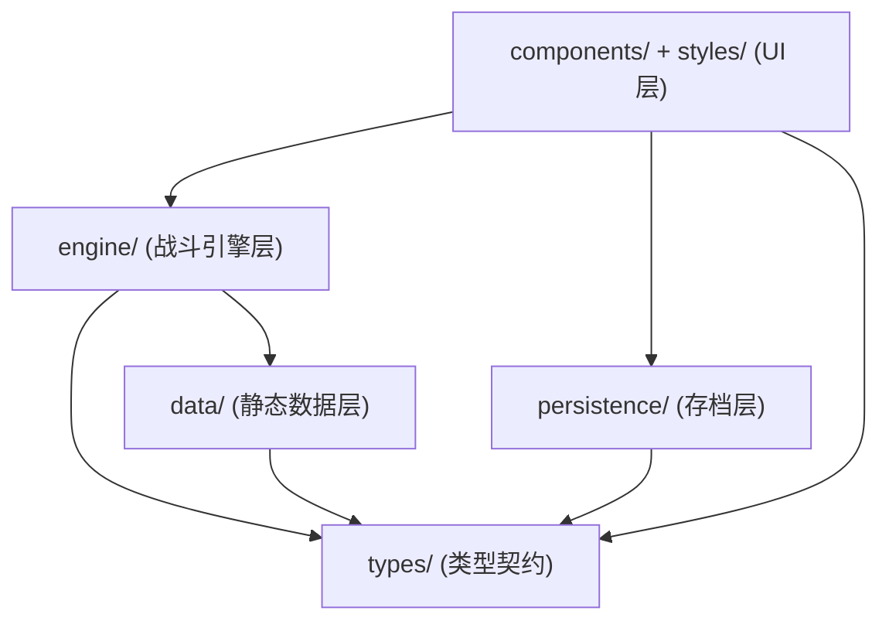
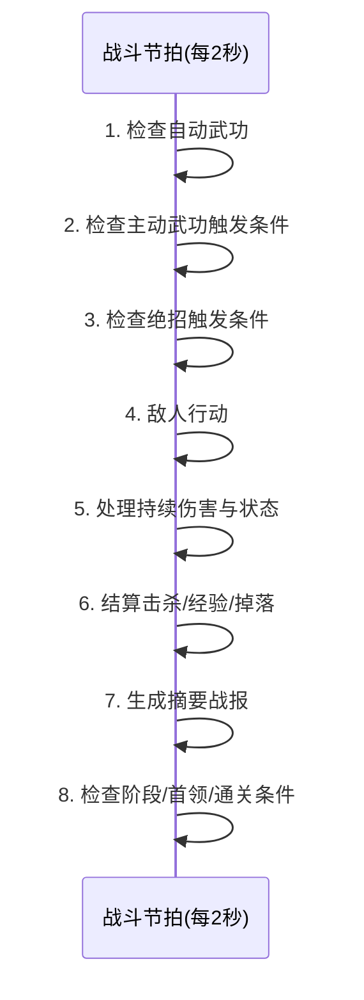
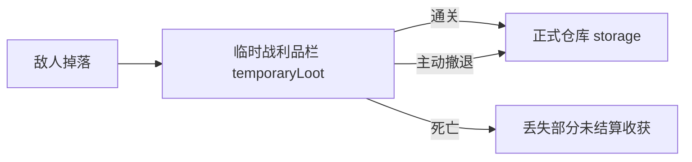
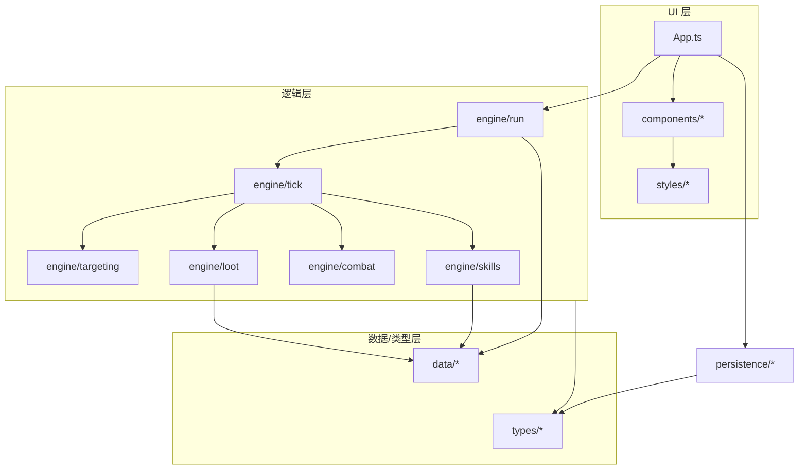

# game006 · Code Wiki

> 文字武侠 · 长期养成 · 全自动战斗 · 短时副本 · 无限刷装备
> 面向开发者与 Coding AI 的项目结构与实现索引文档。

---

## 0. 阅读须知（重要）

**当前仓库状态：这是一个「设计规格仓库」，尚未包含任何可执行源代码。**

仓库根目录现有内容仅有三份 Markdown 文档与一个 Git 元数据目录：

| 路径 | 类型 | 说明 |
| --- | --- | --- |
| `README.md` | 设计愿景 | 项目总览与世界观（偏早期构想，含"割草生存"方向） |
| `GAME_REQUIREMENTS.md` | 需求基准 | **权威开发规格**，长期养成 + 自动战斗定位 |
| `PROMPT_FOR_CODING_AI.md` | 实现指令 | 可直接交付 Coding AI 的 MVP 生成 Prompt |
| `.git/` | 版本控制 | 远程 `origin`，分支 `main` |

因此本文档中的「架构」「模块」「数据模型」「关键函数」等章节，是依据这三份规格文档推导出的**目标（待实现）设计**，而非对现有代码的描述。凡是"计划""目标""待实现"的表述，均表示该部分在仓库中尚无对应代码，需要按规格实现。文中所有数值、字段、流程均**忠实来源于仓库内三份文档**，未做臆造。

> 规格演进提示：`README.md` 描述的是带角色移动的"肉鸽割草生存"版本；`GAME_REQUIREMENTS.md` 明确**排除**角色移动、地图探索与战斗中频繁输入，并确立"固定战场 + 全自动战斗 + 短副本"的定位；`PROMPT_FOR_CODING_AI.md` 进一步把范围收敛为**单一垂直切片 MVP**。当三份文档冲突时，**以 `GAME_REQUIREMENTS.md` 与 `PROMPT_FOR_CODING_AI.md` 为准**。

---

## 1. 项目概述

| 维度 | 内容 |
| --- | --- |
| 项目代号 | `game006` |
| 类型 | 中文单机文字武侠 · 长期养成 · 全自动战斗 · 短时副本 · 刷装备 |
| 目标平台 | 浏览器端，**手机端优先** |
| 语言 | 中文单语言 |
| 核心表现 | 文字战报（分级日志） |
| 战斗方式 | 全自动（进入副本前配置，进入后系统执行） |
| 存档 | 本地持久化（`localStorage`） |
| 明确排除 | 后端、登录、数据库、联网、支付、排行榜、多人、伙伴队伍、复杂 3D、地图探索、角色移动、战斗内频繁输入 |
| 目标技术栈 | Vite + TypeScript（UI 可用原生 HTML/CSS/TS 或现有框架） |

### 1.1 核心体验

玩家扮演一名长期在江湖中成长的侠客（首版固定**青城剑门**，另有"江湖散人"入口）。玩家不在战斗中操作，而是在**进入副本前**完成长期规划：拜师/散人路线、武功修炼、自动战斗配置（目标优先级、触发条件、药品阈值、撤退条件）、装备词条刷取与副本难度选择。

**单次副本失败不重置角色**，仅损失本次副本尚未正式结算的收获——这是与"肉鸽"版本最大的差异。

### 1.2 一句话定位

> 战斗自动、策略前置；副本短、养成长期；武功有灵魂；装备服务构筑。

---

## 2. 仓库结构与文档体系

### 2.1 当前仓库结构

```text
game006/
├── README.md                  # 项目愿景与世界观（偏割草生存方向）
├── GAME_REQUIREMENTS.md       # 权威需求规格（长期养成 + 自动战斗）
├── PROMPT_FOR_CODING_AI.md    # MVP 实现 Prompt / 工程约束
└── .git/                      # 版本控制（origin / main）
```

### 2.2 三份文档的职责划分

| 文档 | 面向对象 | 主要作用 | 权威性 |
| --- | --- | --- | --- |
| `README.md` | 策划 / 玩家视角 | 世界观、门派、区域、玩法乐趣、设计目标 | 概念参考 |
| `GAME_REQUIREMENTS.md` | 开发者 / 需求方 | 产品定位、系统规则、数据结构、优先级、验收 | **需求基准** |
| `PROMPT_FOR_CODING_AI.md` | Coding AI / 工程 | 技术栈、目录规划、实现顺序、工程约束 | **实现约束** |

---

## 3. 目标（待实现）软件架构

> 以下结构与技术选型来自 `PROMPT_FOR_CODING_AI.md` §11 的推荐目录与 `GAME_REQUIREMENTS.md` §14 的数据结构。仓库中目前**尚无 `src/` 目录**，需在实现阶段创建。

### 3.1 目标技术栈

- **构建工具**：Vite
- **语言**：TypeScript（要求类型安全）
- **UI**：原生 HTML/CSS/TS 或轻量 UI 框架（不强制）
- **持久化**：`localStorage` 或既有前端持久化方案
- **运行环境**：纯前端，无后端 / 无外部 API

### 3.2 目标目录结构（规划）

```text
src/
├── data/              # 静态数据：角色、武功、敌人、副本、装备
│   ├── skills.ts      #   武功数据（品级/境界/类型/效果/触发）
│   ├── enemies.ts     #   敌人与首领数据（阶段/技能/掉落）
│   ├── dungeons.ts    #   副本定义（乱石官道等）
│   ├── equipment.ts   #   装备部位/品质/词条池
│   └── sects.ts       #   门派定义（青城剑门等）
├── engine/            # 战斗核心逻辑
│   ├── tick.ts        #   战斗节拍（2 秒）编排
│   ├── targeting.ts   #   自动目标选择（优先级）
│   ├── skills.ts      #   技能触发 / 冷却 / 资源消耗 / 境界效果
│   ├── combat.ts      #   伤害结算、状态、持续伤害
│   ├── loot.ts        #   击杀结算、经验、掉落生成
│   └── run.ts         #   副本生命周期与阶段推进
├── persistence/       # localStorage 存档读写
├── components/        # UI 组件（角色卡、战场卡、日志、配置面板等）
├── styles/            # 全局样式与武侠暗色主题
├── types/             # TypeScript 类型定义（见 §4）
└── App.ts / App.tsx   # 应用入口
```

### 3.3 分层架构图



依赖方向为**单向**：UI → engine → data/types；persistence 依赖 types 与 UI 状态。`data/` 为纯静态数据，不反向依赖引擎，保证可测试与可扩展。

---

## 4. 核心数据模型（类型契约）

> 来源：`GAME_REQUIREMENTS.md` §14「推荐数据结构」。这些接口是模块间的核心契约，计划落地于 `src/types/`。

### 4.1 `Character`（角色）

```ts
interface Character {
  id: string;
  name: string;
  level: number;                    // 人物等级（1—100 首版）
  sectId: string | null;            // 所属门派；null = 江湖散人
  attributes: {
    physique: number;               // 体魄：气血/外功/防御
    constitution: number;           // 根骨：内力/恢复/内功
    agility: number;                // 身法：攻速/闪避
    insight: number;                // 悟性：熟练度/境界成长
    courage: number;                // 胆魄：暴击/抗控制
  };
  cultivation: number;              // 修为
  learnedSkills: SkillProgress[];   // 已学武功及其进度
  equipment: EquipmentLoadout;      // 已穿戴装备
  inventory: Item[];                // 背包
  storage: Item[];                  // 正式仓库
  reputation: Record<string, number>; // 门派声望
}
```

### 4.2 `SkillProgress` / `Skill`（武功）

```ts
interface SkillProgress {
  skillId: string;
  grade: SkillGrade;                // 天生品级
  realm: SkillRealm;                // 当前境界
  proficiency: number;              // 熟练度
  revealedEffects: string[];        // 已揭示效果
  hiddenState: string;              // 神秘武功的隐藏状态
}

interface Skill {
  id: string;
  name: string;
  sectId: string | null;
  grade: SkillGrade;
  type: 'auto' | 'conditional' | 'passive' | 'ultimate'; // 四类武功
  tags: string[];                   // 组合标签（用于共鸣）
  knownEffects: SkillEffect[];
  hiddenEffects: SkillEffect[];     // 未揭示效果
  trigger: TriggerRule | null;      // 释放条件
  targetRule: TargetRule;           // 目标逻辑
}
```

### 4.3 `DungeonRun`（副本实例）

```ts
interface DungeonRun {
  dungeonId: string;
  difficulty: string;               // 普通→困难→险绝→地狱→天灾→无间
  phase: number;                    // 当前阶段
  elapsedSeconds: number;
  characterSnapshot: CharacterSnapshot; // 进入副本时的角色快照
  temporaryLoot: Item[];            // 临时战利品栏
  log: BattleLogEntry[];            // 战斗日志
  status: 'running' | 'cleared' | 'retreated' | 'dead';
}
```

### 4.4 其他类型（需在 `types/` 中补充定义）

文档中引用但未给出完整定义的类型，实现时需自行补全：`SkillGrade`、`SkillRealm`、`SkillEffect`、`TriggerRule`、`TargetRule`、`EquipmentLoadout`、`Item`、`CharacterSnapshot`、`BattleLogEntry`。

---

## 5. 模块职责详解（规划）

| 模块 | 职责 | 关键产出 |
| --- | --- | --- |
| `data/` | 以纯数据描述游戏内容，与逻辑解耦 | 武功表、敌人/首领表、副本阶段表、装备词条池、门派表 |
| `engine/tick` | 实现 2 秒战斗节拍与固定执行顺序 | 每节拍推进一次战斗状态机 |
| `engine/targeting` | 按优先级自动选敌 | 默认：首领 > 特殊敌人 > 远程 > 精英 > 普通 |
| `engine/skills` | 四类武功的触发、冷却、内力消耗、境界效果 | 自动/条件/被动/绝招的释放判定 |
| `engine/combat` | 伤害、暴击、防御、持续伤害与状态结算 | 数值回合结算 |
| `engine/loot` | 击杀结算：经验、熟练度、掉落生成 | 临时战利品、经验入账 |
| `engine/run` | 副本生命周期：进入→波次→首领→结算 | 阶段推进、通关/撤退/死亡 |
| `persistence/` | 存档序列化与 `localStorage` 读写 | 角色/武功/装备/配置/日志模式持久化 |
| `components/` | 单页 UI：状态卡、战场卡、日志、配置、结算弹窗 | 手机端优先界面 |
| `styles/` | 武侠暗色主题（墨色/宣纸/竹简/朱砂/青玉） | 高对比、触屏可读 |
| `types/` | 全项目 TypeScript 接口 | 跨模块契约 |

---

## 6. 关键系统设计

### 6.1 战斗引擎：固定战场 + 2 秒节拍

进入副本后玩家**不移动、不探索**，敌人按波次/阶段出现，系统自动选敌与施法。每个战斗节拍固定为 **2 秒**，按如下顺序执行（来源 `PROMPT_FOR_CODING_AI.md` §3.2）：



战斗控制能力要求：开始/暂停、1x/2x/4x 速度、自动战斗、手动撤退、死亡结算、通关战利品确认入库。

### 6.2 目标选择（自动优先级）

系统提供默认优先级，允许玩家在副本前调整：

1. 副本**首领**
2. 敌方**治疗者 / 解毒者 / 召唤者**等特殊机制单位
3. **远程**敌人
4. **精英**敌人
5. 血量最低目标 / **普通**敌人

建议按战斗阶段自动切换策略：普通波次优先远程与精英；首领阶段优先首领及其关键辅助单位。

### 6.3 武功系统

**四类武功**（`Skill.type`）：

| 类型 | 规则 |
| --- | --- |
| `auto` 自动武功 | 按冷却、资源、条件自动施放，构成主要输出/控制 |
| `conditional` 主动武功 | 玩家预设触发条件，系统自动释放 |
| `passive` 被动心法 | 持续修改属性/资源/状态/战斗规则 |
| `ultimate` 绝招 | 按怒气、真气、敌人数或首领阶段自动释放 |

**六档品级**（先天资质，不可通过普通升级改变）：
`凡品 → 良品 → 上品 → 绝品 → 神品 → 禁品`

> 设计红线：**低品级武功不能被设计成废品**，可通过长期修炼至大乘、专精、低消耗或特殊联动形成独特流派。

**九重境界**（提升必须改变招式表现，而非只加伤害数字）：
`初窥门径 → 略有小成 → 融会贯通 → 炉火纯青 → 登堂入室 → 出神入化 → 一代宗师 → 返璞归真 → 大乘`

**熟练度三种来源**：实战修炼（主要）、闭关修炼（离线/挂机）、传承突破（高境界需秘籍残页/事件/试炼）。

**神秘武功**分三档揭示：公开武功 / 部分未知武功 / 完全神秘武功；原则是"可以让玩家不知道答案，但不能让玩家觉得系统在无理由欺骗"。

**武功共鸣**：多门武功满足条件触发组合效果（如"万剑归宗""毒雾扩散""金钟铁壁""阴阳调和"）。共鸣由 `Skill.tags` 驱动，不设固定职业限制。

### 6.4 首版武功清单（青城剑门）

| 武功 | 品级 | 类型 | 定位 |
| --- | --- | --- | --- |
| 基础剑法 | 凡品 | 自动 | 高频、适合长期专精 |
| 青城吐纳术 | 凡品 | 被动 | 提高内力恢复与修炼效率 |
| 青云剑诀 | 良品 | 自动 | 多目标剑气，命中留剑痕 |
| 追风十三剑 | 上品 | 条件 | 优先精英/首领，多段连击 |
| 青云步 | 上品 | 条件 | 低血/受控时闪避解控 |
| 天河剑气 | 绝品 | 自动 | 大范围穿透剑气 |
| 无形剑 | 绝品 | 被动 | 隐藏剑痕与高威胁目标机制 |
| 青城剑意 | 神品 | 被动 | 命中/暴击/精英击杀积累剑意 |
| 万剑归宗 | 神品 | 绝招 | 首领出现或敌人密集时清场 |

> 首版可先实现其中 4—6 门完成闭环，其余作为后续扩展数据（可先实现 6 门）。

### 6.5 装备系统

- **部位（首版 8 个）**：武器、头部、身甲、护腕、腰带、鞋履、饰品、秘宝。
- **品质**：普通 → 精良 → 稀有 → 史诗 → 传说 → 神话。
- **词条层级**：基础属性（攻/防/气血/内力/五维）、武功方向（剑法伤害/范围/暗器数量等）、战斗行为（击杀回复内力、暴击后强化下一门武功、低血减伤等）、**规则改变**（如剑气留永久剑痕、中毒扩散、凡品视为高一品级）。**规则改变词条是长期刷装备的核心追求。**
- **套装**：2 / 4 / 6 件效果；须支持 2+2+2 混搭，不能强到只剩唯一答案。
- **强化路径**：强化（基础属性）、精炼（指定词条数值）、洗练（重随辅助词条、可锁定）、传承（转移核心词条）。
- **掉落来源**：普通敌人（基础）、精英（高品质/秘籍）、首领（专属/传奇/稀有武功）、隐藏副本（传说/神话/神秘武功）。

### 6.6 副本系统：乱石官道（首版）

| 项 | 值 |
| --- | --- |
| 类型 | 普通战斗副本 |
| 推荐等级 | 10—20 |
| 目标时长 | 2—5 分钟 |
| 通关条件 | 击败**黑风寨主** |

**阶段设计**：

1. 探路山贼 —— 山贼刀手、棍手，数量多、威胁低
2. 弓弩伏击 —— 加入黑风弓手（远程优先处理）
3. 黑风力士 —— 加入高防御精英，需破甲/高频攻击
4. 副寨主 —— 召唤护卫 + 范围技能
5. 黑风寨主 —— 最终首领，**狂刀 / 黑风聚气 / 困兽** 三阶段

**首领掉落**：良品或上品装备、门派贡献、修炼资源、追风十三剑残页、黑风断首刀、山贼首领相关称号/词条。

**难度梯度**：普通 → 困难 → 险绝 → 地狱 → 天灾 → 无间，影响敌人属性、精英数量、首领机制、掉落等级、稀有词条概率、神秘武功概率与死亡损失比例。

### 6.7 掉落与结算流程



| 结局 | 收获处理 |
| --- | --- |
| 正常通关 | 带回全部临时战利品 + 完整副本奖励 + 结算熟练度/贡献/任务 |
| 主动撤退 | 带回已拾取临时战利品；失去未完成副本奖励；可扣少量积分 |
| 战斗死亡 | 副本失败；丢失副本内**尚未结算**的部分收获；长期角色/已学武功/正式仓库不受影响 |

> 红线：失败要有风险，但**不能让玩家感觉长期积累被摧毁**。

### 6.8 角色属性与原型公式

五项主属性：体魄、根骨、身法、悟性、胆魄。原型公式（应集中于单一常量文件便于调整）：

```text
最大气血 = 100 + 体魄 × 20 + 人物等级 × 15
最大内力 = 50 + 根骨 × 12 + 人物等级 × 8
攻击力   = 武器攻击 + 体魄 × 3 + 人物等级 × 5
防御力   = 装备防御 + 体魄 × 1.5 + 根骨
攻击速度 = 基础速度 × (1 + 身法 × 0.5%)
修炼效率 = 100% + 悟性 × 1%
暴击率   = 5% + 胆魄 × 0.25%
```

**人物等级与武功境界必须分离**（例：人物等级 120 / 基础剑法 大乘 / 青云剑诀 初窥门径）。

战斗资源：气血、内力/真气、怒气、精力、心魔、侠义/恶名。

### 6.9 门派系统

- **门派弟子**：武功来源稳定、晋升明确（记名 → 外门 → 内门 → 真传 → 核心 → 掌门传人），有师门任务/商店/试炼/专属装备。
- **江湖散人**：自由但获取不稳定（掉落、秘籍、拍卖、奇遇、残卷拼合、偷学、首领传承等）。
- **叛门**：已学武功与境界不消失，但失去晋升资格与部分福利、声望下降、可能被追杀。
- **跨门派**：门派身份与武功归属分离，可学他派武功但不获其晋升资格，跨派组合可能冲突或形成隐藏绝学。

两条路线**不应存在绝对强弱**。

### 6.10 文字表现：分级日志

- **普通事件 → 汇总**：如"青云剑诀连续斩杀 8 名山贼。当前剩余敌人：24。"
- **重要事件 → 详细武侠描写**：首次使用武功、绝招释放、境界突破、武功共鸣、精英/首领登场、濒死反杀、稀有掉落、通关/死亡。
- **三档模式**：简洁 / 标准 / 详细；手机端默认简洁。**禁止把每次普通攻击逐条刷屏。**

### 6.11 放置挂机（建议）

三种模式：**安全扫荡**（低难已通关，可离线，收益略低）、**自动挑战**（提前设次数与撤退条件，可能失败，需展示预计胜率与风险）、**极限挑战**（首通/高难首领/无尽，奖励与风险最高，需完整日志）。

---

## 7. 模块依赖关系



关键依赖原则：

1. `data/` 只依赖 `types/`，为纯静态数据，可独立测试。
2. `engine/` 依赖 `data/` 与 `types/`，不含 UI 代码。
3. `components/` 依赖 `engine/` 的对外接口与 `persistence/`，不直接改数据文件。
4. 数值常量集中管理（对应 §6.8 公式与掉落/成长曲线），避免散落各处。

---

## 8. 运行方式（目标）

> 仓库当前无代码，以下为**实现后的目标运行方式**，来自 `PROMPT_FOR_CODING_AI.md` 技术栈约定。

```bash
# 安装依赖
npm install

# 开发（Vite 本地服务器）
npm run dev

# 构建（必须成功，作为验收项）
npm run build

# 预览构建产物
npm run preview

# 单元测试（至少提供可重复的战斗模拟函数）
npm test
```

工程要求（验收硬性条件）：

1. 检查现有项目结构，避免覆盖已有代码；
2. 数据 / 战斗引擎 / 掉落 / 存档 / UI 分模块；
3. 数值常量集中管理；
4. 保持 TypeScript 类型安全；
5. 添加基础单元测试，或至少提供可重复的战斗模拟函数；
6. `npm run build` 成功；
7. 不使用后端和外部 API；
8. 不添加未请求的登录/联网/支付/多人功能；
9. 不逐条刷普通伤害日志；
10. 不用占位按钮冒充未实现功能，未实现项须明确标注"后续内容"。

---

## 9. 开发优先级与路线图

### P0 · 必须先完成（垂直切片闭环）

- 单角色状态；固定副本；2 秒自动战斗节拍；敌人波次；自动目标选择
- 自动武功；战斗摘要日志；首领与通关；临时战利品；死亡损失
- 基础装备掉落；青城剑门最小武功集

### P1 · 核心长期体验

- 武功境界与熟练度；武功文字表现；装备词条；装备穿戴与仓库
- 副本难度；门派晋升；闭关修炼；安全扫荡

### P2 · 扩展内容

- 江湖散人机缘；神秘武功逐步揭示；叛门与跨门派；套装
- 传说/神话装备；武功共鸣；百毒谷及其他门派；无尽副本
- 保护目标副本；多结局

> 原则：**先做小而完整的垂直切片，再长期扩展。**

---

## 10. 验收标准（首版原型）

玩家应能完成以下闭环（来源 `PROMPT_FOR_CODING_AI.md` §12 与 `GAME_REQUIREMENTS.md` §16）：

1. 打开游戏看到中文角色界面，查看青城剑门角色属性；
2. 查看已学武功及境界；
3. 配置自动目标优先级与武功触发条件；
4. 点击进入"乱石官道"；
5. 在**不输入任何战斗指令**的情况下自动战斗；
6. 看到敌人阶段推进与关键武功战报；
7. 获得经验、熟练度与临时装备；
8. 击败黑风寨主并进入通关结算；
9. 确认临时战利品进入正式仓库；
10. 触发一次死亡或可测试的死亡模拟，验证临时收获损失；
11. 刷新页面后角色、武功、装备与配置仍然存在。

---

## 11. 设计原则（红线清单）

1. **战斗自动，策略前置。** 玩家配置战斗逻辑，不被迫频繁点击或输入。
2. **副本短，养成长期。** 单局几分钟，角色成长没有终点。
3. **武功有灵魂。** 每门武功要有独特的文字表现、目标逻辑、成长变化与门派爽点。
4. **品级是资质，境界是成就。** 高品级起点高，低品级也能靠长期修炼名扬天下。
5. **神秘但不欺骗。** 未知武功保留期待感，同时通过线索让玩家能够推理。
6. **装备服务构筑。** 装备要能改变武功规则，而非只加数字。
7. **死亡有风险，不毁长期积累。** 只损失本次副本未结算内容。
8. **门派与散人都值得玩。** 门派提供稳定路线，散人提供自由与机缘。
9. **文字表现重于数字刷屏。** 摘要 + 关键描写分级呈现。
10. **先做小而完整的垂直切片，再长期扩展。**

---

## 12. 术语表

| 术语 | 含义 |
| --- | --- |
| 武功品级 | 武功的先天资质（凡/良/上/绝/神/禁），不可通过普通升级改变 |
| 武功境界 | 武功的后天成就（初窥门径 → 大乘），提升会改变招式表现 |
| 江湖散人 | 不拜门派、自由获取武功的成长路线 |
| 共鸣 | 多门武功满足条件触发的组合效果 |
| 临时战利品栏 | 副本内掉落暂存区，通关/撤退后才入库 |
| 正式仓库 | 已结算、长期保留的装备存放区 |
| 战斗节拍 | 固定 2 秒的自动结算单位 |
| 心魔 | 使用禁功/邪派秘宝/违背承诺累积的风险资源 |
| 万流武经 | 世界观核心传说，记录武学修炼规律（结局关键） |

---

## 13. 当前缺口与后续工作

以下内容在仓库中**尚未存在**，是项目从"规格"走向"可玩"必须补齐的：

| 缺口 | 说明 | 对应实现位置 |
| --- | --- | --- |
| 源代码 | 无 `src/`、无构建配置 | 项目根目录 |
| 工程配置 | 无 `package.json` / `vite.config` / `tsconfig` | 项目根目录 |
| 类型补全 | §4 中多个引用类型未给出完整定义 | `src/types/` |
| 数据实现 | 武功/敌人/副本/装备数据均为文字描述 | `src/data/` |
| 引擎实现 | 战斗节拍、目标、掉落、副本生命周期 | `src/engine/` |
| 存档实现 | `localStorage` 序列化与二确认清档 | `src/persistence/` |
| UI 实现 | 单页手机端界面与结算弹窗 | `src/components/` |
| 测试 | 无单元测试、无战斗模拟函数 | 项目测试目录 |
| 许可证 | README 声明待技术方案确定后补充 | `LICENSE` |

---

> 本文档基于仓库内 `README.md`、`GAME_REQUIREMENTS.md`、`PROMPT_FOR_CODING_AI.md` 三份文档整理。若规格发生变更，请同步更新本 Wiki 对应章节。